# ✈️🚆 Travel Tracker App

A modern travel journaling web app for logging flights and train journeys.  
Built with **Vue 3**, **TypeScript**, **Shadcn-Vue**, **Supabase**, and **Leaflet** for real-time stats and visualizations.

## 🧭 Features

- ✨ User authentication (register/login)
- 🛫 Add flight journeys with detailed info (airline, date, seat, price, etc.)
- 🚆 Add train journeys with similar structure
- 🗺️ Interactive map to visualize flight routes
- 📊 Beautiful dashboard with summary statistics and charts
- 🔍 Browse past journeys (split into Flights and Trains tabs)
- 🧾 View and edit each journey’s details
- 🌗 Light/dark mode support
- 🛑 Custom 404 page

---

## 🛠️ Getting Started

### 1. Clone the project

```bash
git clone https://github.com/DJOMIDO/noname-app
cd noname-app
```

### 2. Install dependencies

```bash
npm install
```

### 3. Run the development server

```bash
npm run dev
```

### 4. Setup Supabase

- Create a Supabase project
- Add tables: `flights`, `trains`, `users` as required
- Set up Supabase URL and anon key in your `.env` file:

```env
VITE_SUPABASE_URL=your-supabase-url
VITE_SUPABASE_ANON_KEY=your-anon-key
```

---

## 📸 Screenshots

### Authentication
- **Signup**
  
- **Login**
  

### Home
- **Light Mode**
  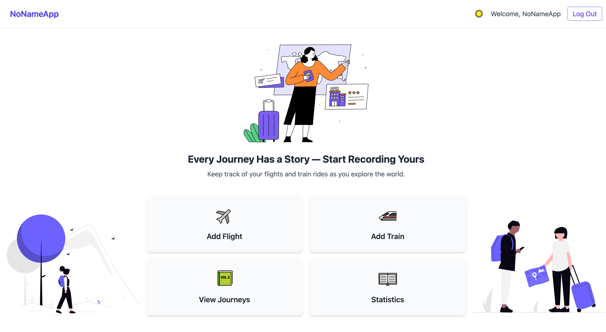
- **Dark Mode**
  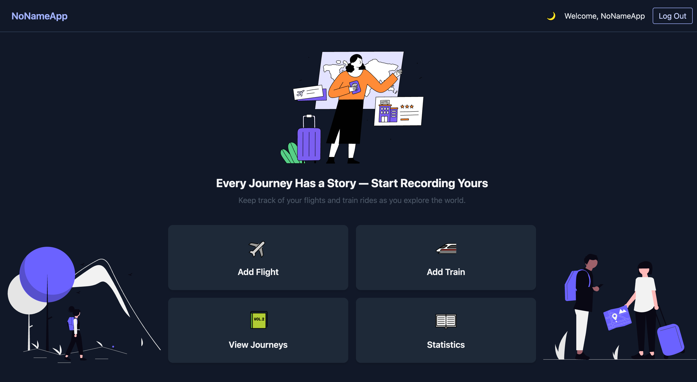

### Add Flight / Train
- **Add Flight (Light)**
  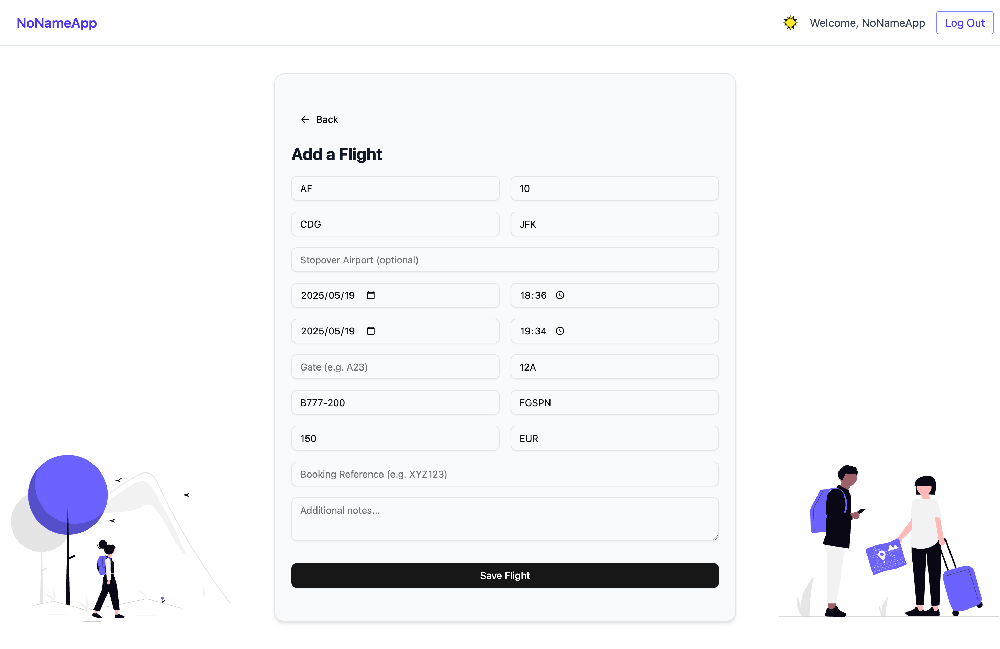
- **Add Flight (Dark)**
  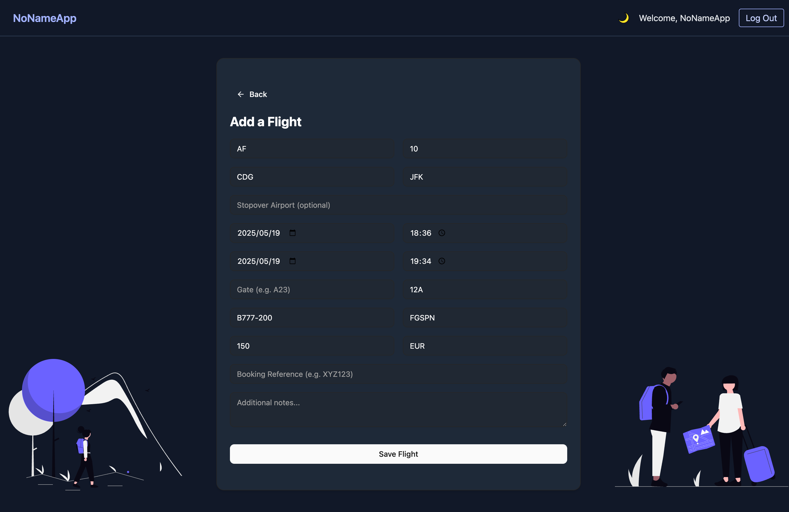
- **Add Train (Dark)**
  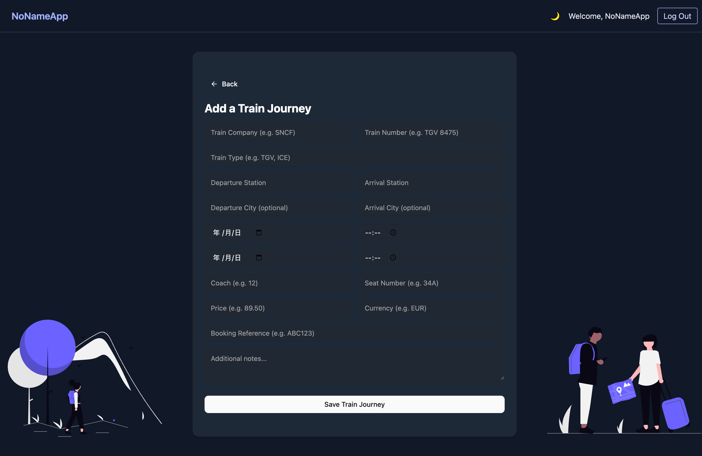

### View Journeys
- **Flights Tab**
  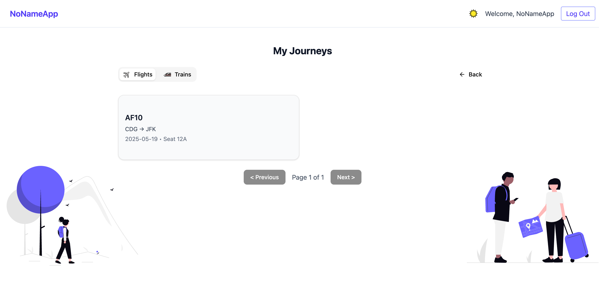
- **Trains Tab (Dark)**
  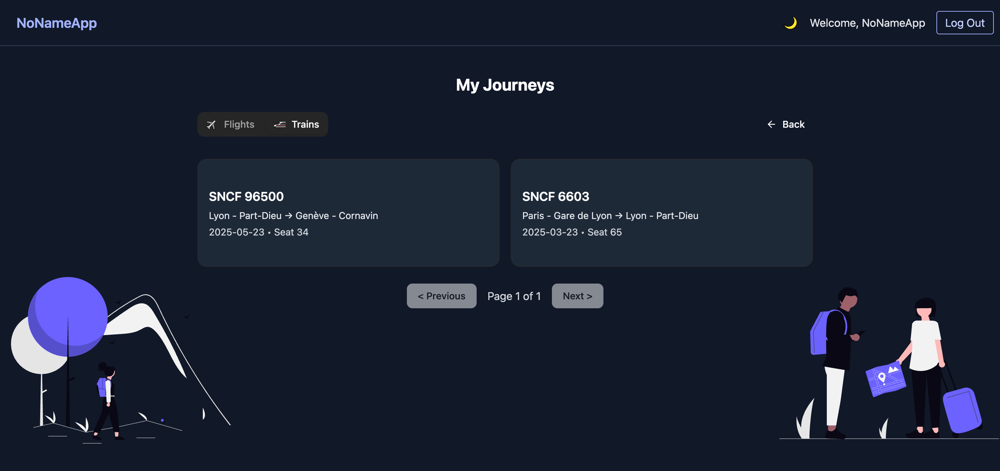

### Dashboard
- **Overview**
  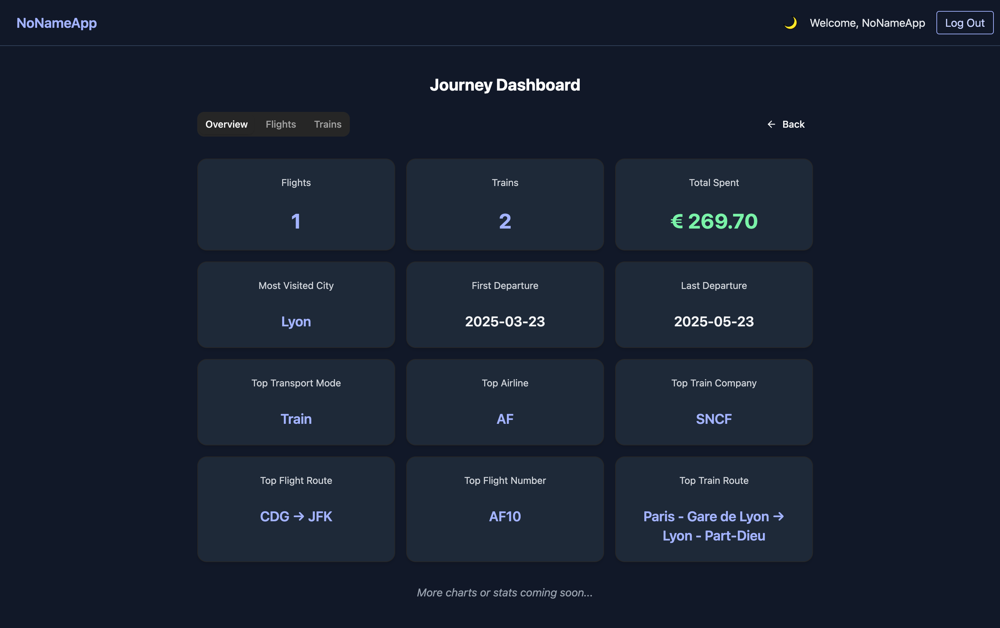
- **Flight Stats (Dark)**
  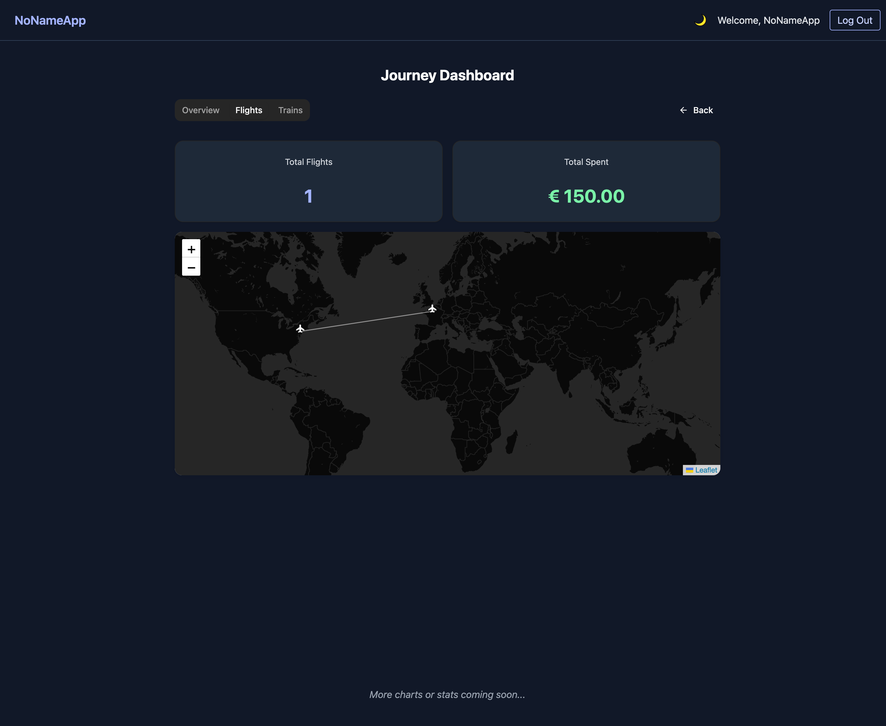
- **Train Stats**
  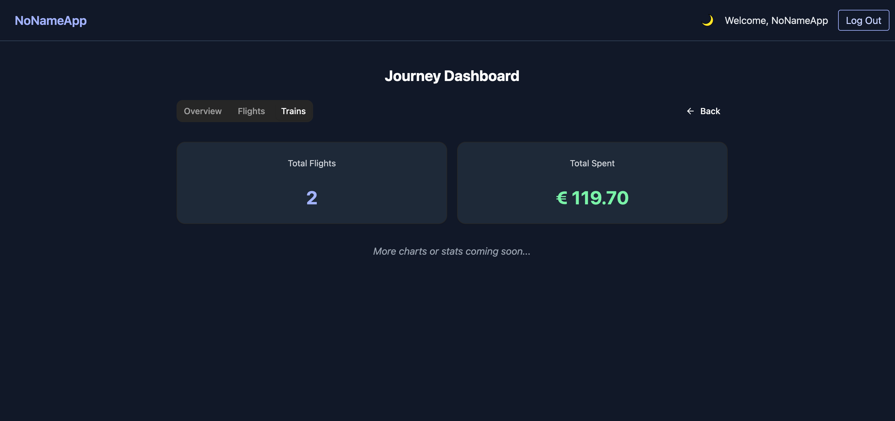

### 404 Page
- 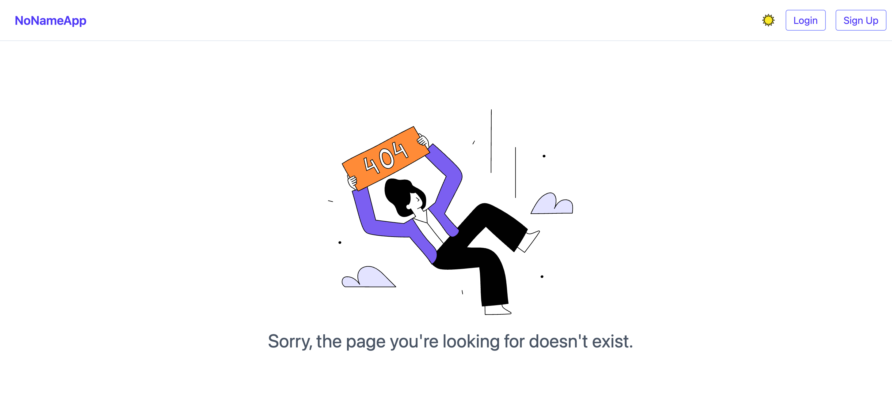

---

## 📄 License

MIT