# ✈️🚆 Travel Tracker App

A modern travel journaling web app for logging flights and train journeys.  
Built with **Vue 3**, **TypeScript**, **Shadcn-Vue**, **Supabase**, and **Leaflet** for real-time stats and visualizations.

## 📐 Project Development Requirements

All feature work must follow the project-level development requirements, including
`feat/*` branches, componentized implementation, shadcn-vue/Tailwind CSS usage,
and successful tests before merging into `master`.

See [PROJECT_REQUIREMENTS.md](./PROJECT_REQUIREMENTS.md).

## 🧭 Features

- ✨ User authentication (register/login)
- 🛫 Add flight journeys with detailed info (airline, date, seat, price, etc.)
- 🚆 Add train journeys with similar structure
- 🗺️ Interactive map to visualize flight routes
- 📊 Beautiful dashboard with summary statistics and charts
- 🔍 Browse past journeys (split into Flights and Trains tabs)
- 🧾 View and edit each journey’s details
- 📥 Import multiple flight or train journeys from CSV
- 🌗 Light/dark mode support
- 🛑 Custom 404 page

---

## 🛠️ Getting Started

### 🌐 Live Demo

You can try the app online here:  
👉 [https://nonameapp.netlify.app](https://nonameapp.netlify.app)

### 1. Clone the project

```bash
git clone https://github.com/DJOMIDO/noname-app
cd noname-app
```

### 2. Install dependencies

```bash
npm install
```

### 3. Run the development server

```bash
npm run dev
```

### 4. Setup Supabase

- Create a Supabase project
- Add tables: `flights`, `trains`, `users` as required
- Set up Supabase URL and anon key in your `.env` file:

```env
VITE_SUPABASE_URL=your-supabase-url
VITE_SUPABASE_ANON_KEY=your-anon-key
VITE_SITE_URL=https://your-netlify-site.netlify.app
```

`VITE_SUPABASE_URL` must be a real project URL such as
`https://your-project-ref.supabase.co`, not the literal example value
`your-supabase-url`. `VITE_SUPABASE_ANON_KEY` must likewise be replaced with
the project's publishable/anon key. Restart the Vite dev server after changing
`.env`; Vite does not reload environment files automatically.

`VITE_SITE_URL` is used as the email confirmation redirect URL. In Supabase,
add the same URL to **Authentication → URL Configuration → Redirect URLs**
(and set it as the Site URL if desired). For local development, you can use
`http://localhost:3000`.

### CSV journey import

After signing in, open **Add Flight** or **Add Train** from the home page.
The **Import CSV** and **Download template** actions are placed beside the
Basic/Detailed tabs. Download the matching template before importing so that
the column names match the existing `flights` or `trains` table fields exactly.

Required flight columns:

`airline_code`, `flight_number`, `departure_airport`, `arrival_airport`,
`departure_date`

Required train columns:

`train_company`, `train_number`, `departure_station`, `arrival_station`,
`departure_date`

Optional columns are included in each downloaded template. Dates must use
`YYYY-MM-DD`; times use `HH:mm` (or `HH:mm:ss`), and prices must be
non-negative numbers. Rows with validation errors are shown in the preview and
are skipped when valid rows are imported.

---

## 📸 Screenshots

### Authentication
- **Signup**
  
- **Login**
  

### Home
- **Light Mode**
  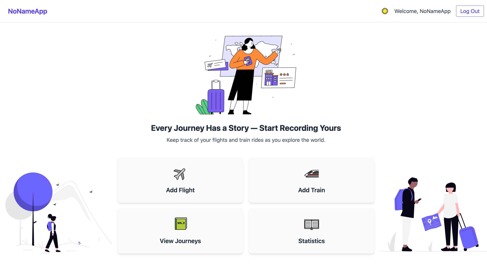
- **Dark Mode**
  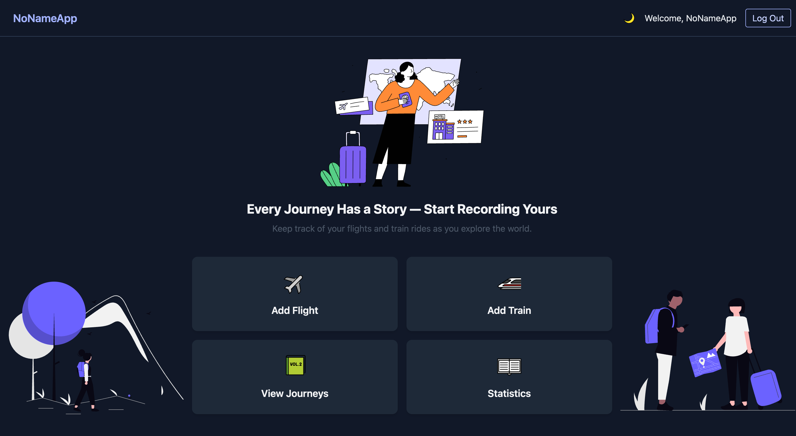

### Add Flight / Train
- **Add Flight (Light)**
  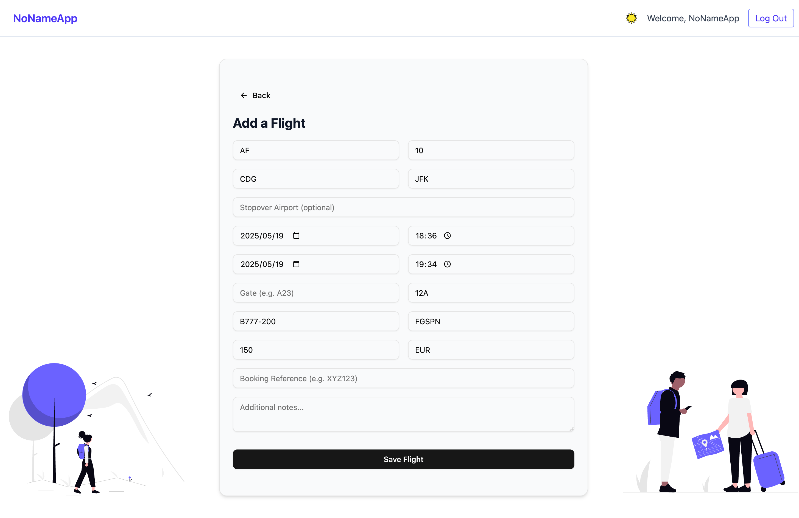
- **Add Flight (Dark)**
  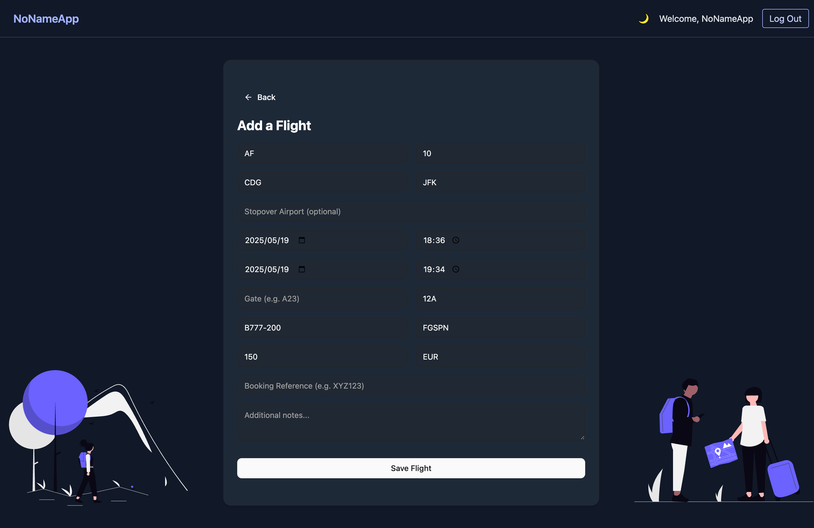
- **Add Train (Dark)**
  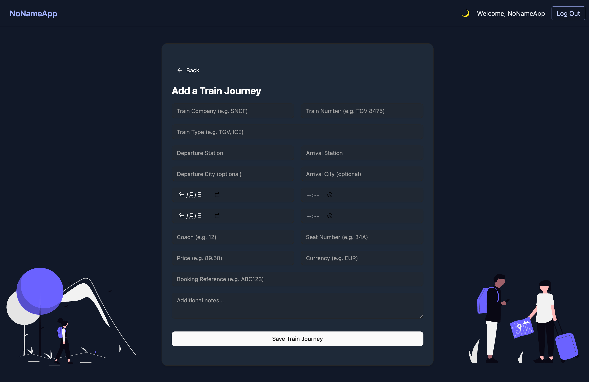

### View Journeys
- **Flights Tab**
  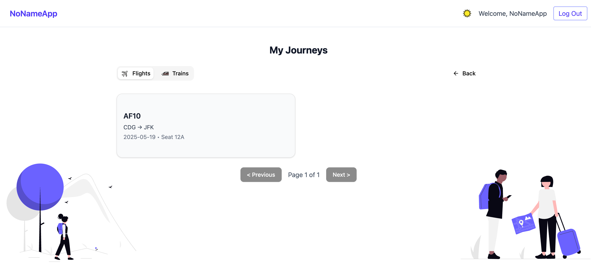
- **Trains Tab (Dark)**
  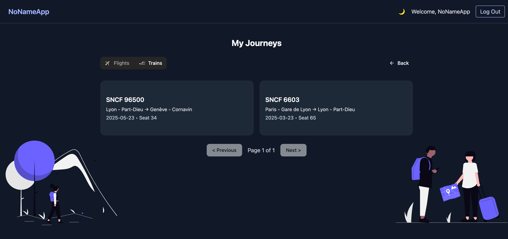

### Dashboard
- **Overview**
  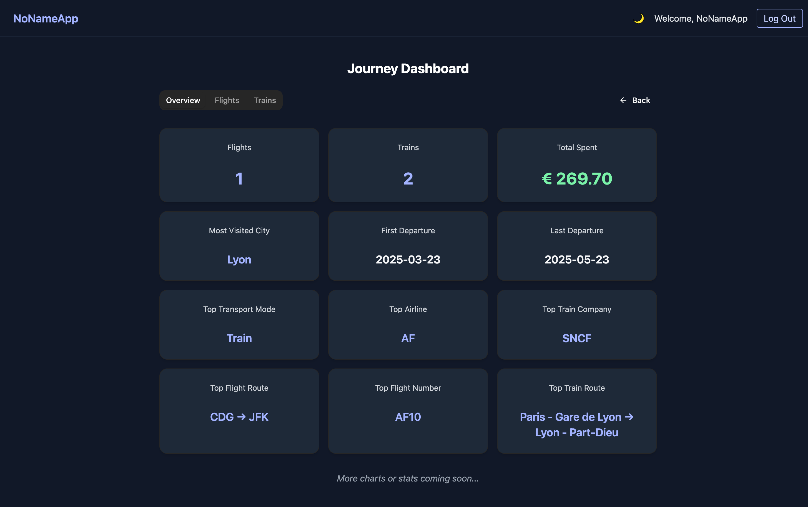
- **Flight Stats (Dark)**
  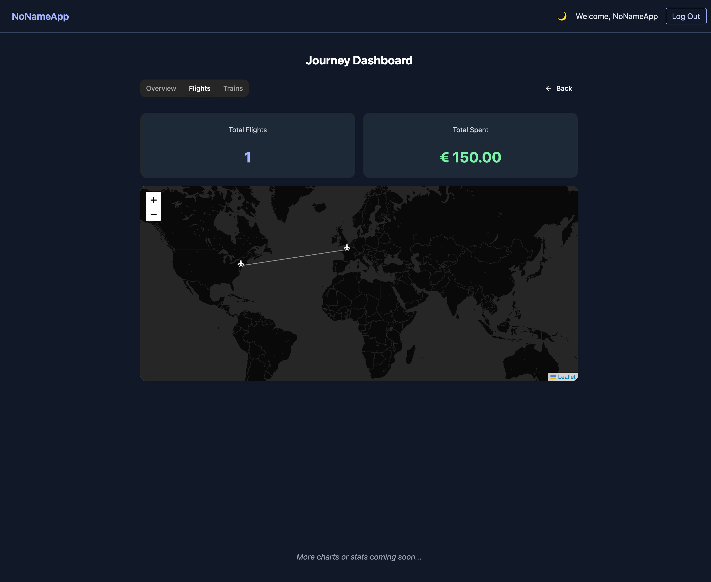
- **Train Stats (Dark)**
  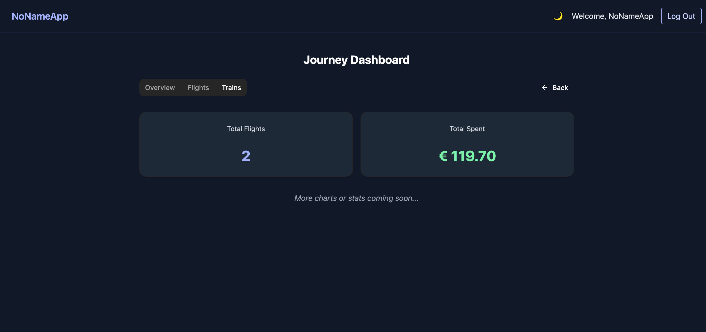

### 404 Page
- 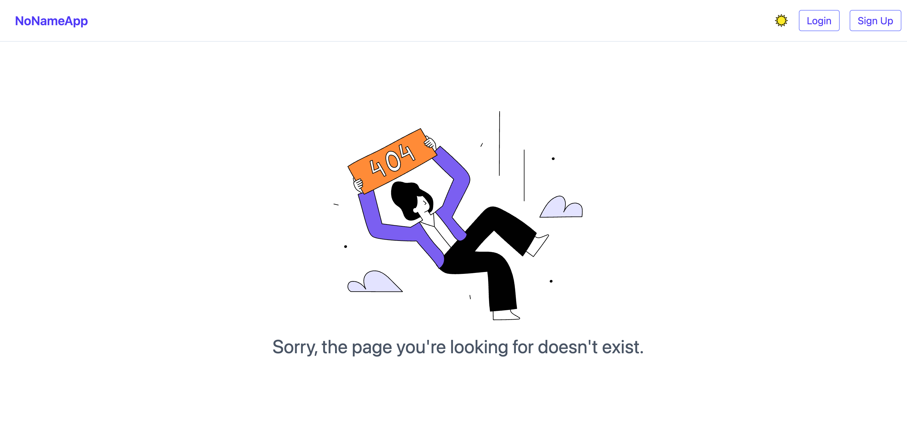

---

## 📄 License

MIT